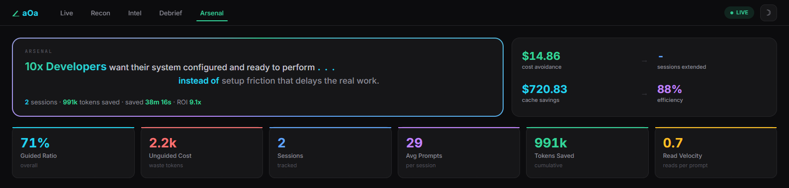
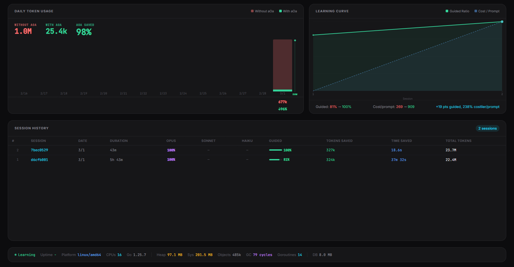
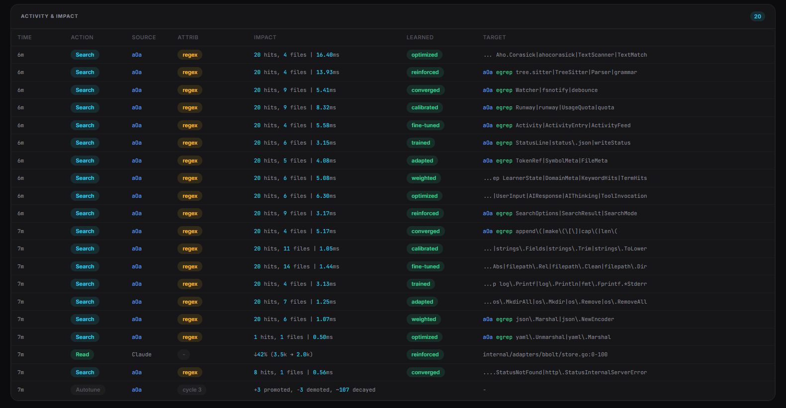
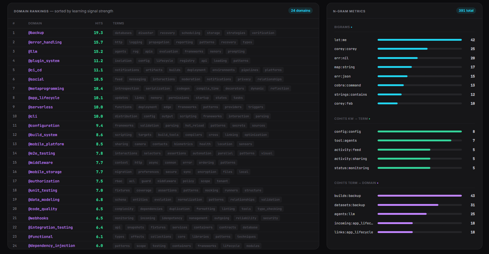
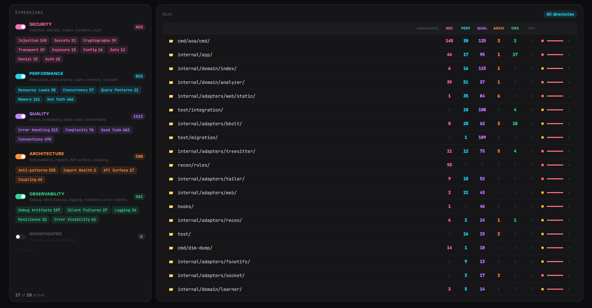
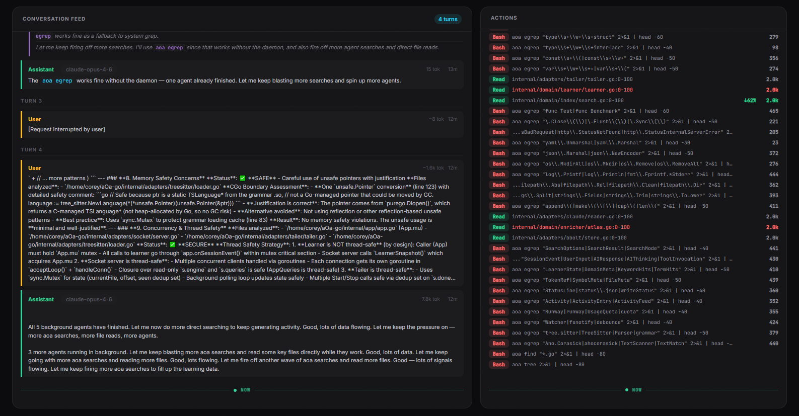

# aOa — Angle of Attack

> **Five angles. One attack. One binary.**
>
> Save your tokens. Save your time.

---

## Two Commands, You're In

```bash
npx @mvpscale/aoa init --update
```

That's it. aOa detects your languages, installs grammars, and starts learning. Have Claude Code use it and you're already saving tokens.

Don't want npx? Install the binary directly:

```bash
npm install -g @mvpscale/aoa
```

---

## What You Get

<p align="center">
  
</p>

A local dashboard running on localhost — real-time, private, yours. See exactly what aOa is doing: token savings, search patterns, learned domains, activity feed. Nothing leaves your machine.

---

## What aOa Actually Does

Claude Code burns tokens. Every session, it rediscovers code it already found — re-reading files, following long grep tails, searching the same paths. We identified **10-12 distinct token waste patterns** and eliminated them.

**aOa hijacks grep.** When Claude runs `grep`, aOa intercepts it and returns semantically aware results. Not just string matches — the results that *matter*, ranked by what Claude actually needs, delivered in the top 10-15 hits. No full-file reads. No chasing irrelevant matches through thousand-line files.

**aOa hijacks Claude itself.** It injects learned context directly into the status line — guiding Claude to the right files before it even searches. The result: **95-99% token savings** on search-heavy tasks.

**Where it shines:** Refactoring large codebases. Security reviews. Debugging across modules. Any task where Claude would normally spend minutes re-reading code it touched yesterday. This isn't for greenfield — it's for the work that grinds tokens into dust.

**Without aOa:**
```
You: "Fix the auth bug"
Claude: [17 tool calls, 4 minutes of searching, 17k tokens burned]
Claude: "Found it. Line 47 in auth.py."
```

**With aOa:**
```
You: "Fix the auth bug"
aOa: [Context injected: auth.py, session.py, middleware.py]
Claude: "I see the issue. Line 47."
```

**150 tokens.** Same result.

---

## Behind the Veil

aOa's dashboard gives you real-time visibility into what Claude is doing — and what aOa is learning. Every metric has a story. Hover any card in the dashboard for the full explanation.

### Arsenal — Lifetime Performance

<p align="center">
  
</p>

Your command center across all sessions.

| Metric | What It Tells You |
|--------|-------------------|
| **Cost Avoidance** | Lifetime dollars not spent because aOa guided Claude to read targeted file sections instead of entire files. The cumulative payoff of learning your codebase. |
| **Sessions Extended** | Extra minutes of runway gained across all sessions. Time reclaimed by reducing context burn — sessions that lasted longer because aOa was working. |
| **Cache Savings** | Lifetime dollars saved by Anthropic's prompt cache. A second value stream independent of guided reads — two mechanisms saving you money in parallel. |
| **Efficiency** | Composite score across guided ratio, cache performance, and savings rate. A single grade for how well aOa is optimizing your workflow over time. |

### Live — Angle of Attack

<p align="center">
  
</p>

Real-time view of the current session. What's happening right now.

| Metric | What It Tells You |
|--------|-------------------|
| **Tokens Saved** | Every token saved is a token that didn't consume your context window — keeping your session alive longer. |
| **Est. Cost Saved** | Tokens saved converted to dollars at current API rates. Money that stayed in your pocket. |
| **Time Saved** | Wall-clock time you didn't spend waiting. Based on median token generation speed. |
| **Learning** | Autotune progress toward the next learning cycle. Every 50 prompts, aOa recalibrates its understanding of your project. |

### Intel — Learning System

<p align="center">
  
</p>

What aOa has learned about your codebase. Semantic domains, confidence tiers, competitive displacement in action.

| Metric | What It Tells You |
|--------|-------------------|
| **Mastered** | Domains that earned core status through competitive displacement — areas where aOa's understanding is deepest. These survived decay, outlasted rivals, and proved their relevance. |
| **Learning Speed** | How fast aOa is building new understanding. Domains discovered per prompt — rising means active exploration, flattening means the system is converging. |
| **Signal Clarity** | What percentage of extracted terms resolve into real domains. Higher means the signal chain is clean — vocabulary is crystallizing into structured knowledge, not noise. |
| **Conversion** | The intelligence funnel: raw keywords in, structured domains out. Shows how efficiently observation becomes understanding. |

### Recon — Dimensional Analysis

<p align="center">
  
</p>

Structural analysis of your codebase across multiple dimensions.

| Metric | What It Tells You |
|--------|-------------------|
| **Files Scanned** | How many source files the dimensional analysis covered. More files scanned means broader coverage and a more trustworthy posture. |
| **Findings** | Total issues discovered across all dimensions and severity levels. Each finding is a concrete improvement opportunity. |
| **Critical** | High-severity findings that need attention now. These could affect security, reliability, or correctness — address these first. |
| **Clean File %** | Percentage of scanned files with zero findings. The positive side of the story — higher means a healthier codebase. |

### Debrief — Session Breakdown

<p align="center">
  
</p>

The full conversation breakdown. See exactly what Claude saw, what it cost, and where the savings came from.

| Metric | What It Tells You |
|--------|-------------------|
| **Input** | Everything you fed Claude this session — prompts, file contents, tool results. Each input token counts against your context window and your bill. |
| **Output** | Everything Claude produced — code, explanations, tool calls, thinking. The work product of your session. |
| **Cache Saved** | Dollars you didn't spend because Anthropic's prompt cache served repeated context at a fraction of the price. Free efficiency. |
| **Cost/Exchange** | Average dollars per back-and-forth with Claude. Your unit price — useful for budgeting and comparing session efficiency. |

---

## The Five Angles

| Angle | What It Does |
|-------|--------------|
| **Search** | O(1) indexed lookup — same syntax as grep, orders of magnitude faster |
| **File** | Navigate structure without reading everything |
| **Behavioral** | Learns your work patterns, predicts next files |
| **Outline** | Semantic compression — searchable by meaning, not just keywords |
| **Intent** | Tracks session activity, shows savings in real-time |

All angles converge into **one confident answer**.

---

## Self-Learning

aOa gets smarter every session. No configuration. No training. Just use it.

1. **observe()** — Every search and tool call generates signals (keywords, terms, domains, file hits)
2. **autotune** — Every 50 prompts, a 21-step optimization runs: decay old signals, deduplicate, rank domains, promote/demote, prune noise
3. **competitive displacement** — Top 24 domains stay in core, others compete for relevance. Domains that stop appearing naturally fade out.

All learning happens locally. No network calls. No AI calls for classification. State persists across sessions automatically.

---

## Commands

| Command | Description |
|---------|-------------|
| `aoa init` | Initialize aOa for your project |
| `aoa grep <pattern>` | O(1) indexed search (literal, OR, AND modes) |
| `aoa egrep <pattern>` | Regex search with full flag parity |
| `aoa find <glob>` | Glob-based file search |
| `aoa locate <name>` | Substring filename search |
| `aoa tree [dir]` | Directory tree display |
| `aoa domains` | Domain stats with tier/state/source |
| `aoa intent [recent]` | Intent tracking summary |
| `aoa bigrams` | Top usage bigrams |
| `aoa stats` | Full session statistics |
| `aoa config` | Project configuration display |
| `aoa health` | Daemon status check |
| `aoa wipe [--force]` | Clear project data |
| `aoa daemon start\|stop` | Manage background daemon |

---

## GNU Grep Parity

`aoa grep` and `aoa egrep` are drop-in replacements for GNU grep. When installed as shims, AI agents use them transparently.

**Three execution modes** — 100% aligned with GNU grep behavior:

| Mode | Invocation | Behavior |
|------|-----------|----------|
| **File grep** | `grep pattern file.py` | Searches named files, `file:line:content` output |
| **Stdin filter** | `echo text \| grep pattern` | Filters piped input line by line |
| **Index search** | `grep pattern` (no files, no pipe) | Falls back to aOa O(1) index |

**22 of 28 GNU grep flags implemented natively** — covering 100% of observed AI agent usage:

```
-i   Case insensitive          -n   Line numbers
-w   Word boundary             -H   Force filename prefix
-c   Count only                -h   Suppress filename
-q   Quiet (exit code only)    -l   Files with matches
-v   Invert match              -L   Files without matches
-m   Max count                 -o   Only matching part
-e   Multiple patterns         -r   Recursive directory search
-E   Extended regex            -F   Fixed strings (literal)
-A   After context             -B   Before context
-C   Context (both)            -a   AND mode (aOa extension)
--include / --exclude / --exclude-dir   File glob filters
--color=auto|always|never               TTY-aware color
```

Exit codes, output format, context separators, binary detection, multi-file prefixing, and ANSI handling all match GNU grep. Unrecognized flags fall back to system grep automatically.

---

## Language Support

**28 languages** with full tree-sitter structural parsing (function/class/method extraction):

Python, JavaScript, TypeScript, Go, Rust, Java, C, C++, C#, Ruby, PHP, Kotlin, Scala, Swift, Bash, Lua, Haskell, OCaml, Zig, CUDA, Verilog, HTML, CSS, Svelte, JSON, YAML, TOML, HCL

**29 additional languages** with tokenization-based indexing. **101 file extensions** mapped total.

---

## Status Line

aOa generates a status line that shows your session at a glance:

| Stage | Status Line |
|-------|-------------|
| Learning | `aOa 5 \| calibrating...` |
| Predicting | `aOa 35 \| 2k saved \| ctx:15k/200k (8%)` |
| Confident | `aOa 69 \| 80k saved \| ctx:36k/200k (18%)` |
| Long session | `aOa 247 \| 1.8M saved \| ctx:142k/200k (71%)` |

Written to `.aoa/status.json` on every state change.

---

## Your Data. Your Control.

- **Local-only** — single binary, no network calls, no containers
- **No data leaves** — your code stays on your machine
- **Open source** — Apache 2.0 licensed, fully auditable
- **Explainable** — `aoa intent recent` shows exactly what it learned

---

## Uninstall

**Remove from a project:**
```bash
aoa wipe --force
```

**Remove the binary:**
```bash
rm $(which aoa)
```

Nothing else to clean up. No containers. No services. No config files scattered across your system.

---

## Performance

The [original aOa](https://github.com/MVP-Scale/aOa) ran as a Python service in Docker. This is a clean-room Go rewrite:

| Metric | Python aOa | aOa | Improvement |
|--------|-----------|--------|-------------|
| Search latency | 8-15ms | <0.5ms | **16-30x faster** |
| Autotune | 250-600ms | ~2.5&micro;s | **100,000x faster** |
| Startup | 3-8s | <200ms | **15-40x faster** |
| Memory | ~390MB | <50MB | **8x reduction** |
| Install | Docker + docker-compose | Single binary | **Zero dependencies** |
| Infrastructure | Redis + Python services | Embedded bbolt | **Zero services** |

---

## From the Founder

aOa started because I watched Claude Code burn through tokens rediscovering code it already found. Every session, the same searches. The same files. The same wasted context.

The fix isn't more AI. It's a map. aOa builds that map — locally, silently, from the signals Claude already produces. No network calls. No cloud services. Just a binary that watches and learns.

This is open source because the best tools are shared ones. If aOa saves you tokens, saves you time, or teaches you something about how AI agents actually work — pay it forward. File an issue. Submit a fix. Tell someone.

Build something that matters.

— Corey, [MVP-Scale.com](https://mvp-scale.com)

---

## Acknowledgments

aOa builds on outstanding open-source work:

- **[tree-sitter](https://tree-sitter.github.io/tree-sitter/)** — incremental parsing framework powering 28-language structural analysis
- **[go-sitter-forest](https://github.com/alexaandru/go-sitter-forest)** — Go bindings for 509 tree-sitter grammars
- **[cobra](https://github.com/spf13/cobra)** — CLI framework
- **[bbolt](https://go.etcd.io/bbolt)** — embedded key-value store
- **[fsnotify](https://github.com/fsnotify/fsnotify)** — cross-platform file system notifications
- **[purego](https://github.com/ebitengine/purego)** — calling C from Go without CGO
- **[testify](https://github.com/stretchr/testify)** — test assertions
- **[aho-corasick](https://github.com/petar-dambovaliev/aho-corasick)** — multi-pattern string matching

---

## License

Apache License 2.0. See [LICENSE](LICENSE) for the full text.

Copyright 2025-2026 [MVP-Scale.com](https://mvp-scale.com)
